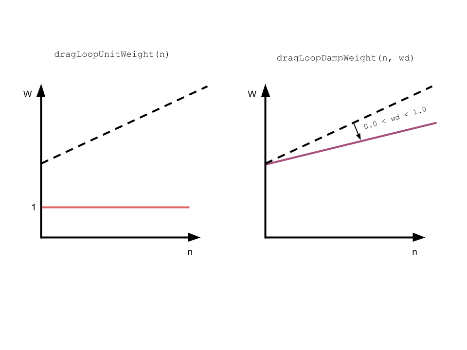

# Chaos Pallet

The Chaos module is used to inject chaos into a Substrate Runtime and intentionally break things.

## Overview

The Chaos module provides functions for:

- Make Substrate Runtimes behave in ways that they're not supposed to.
- Explore Runtime edge cases.
- Explore Extrinsic weights and their economic implications.
- Expose Runtime Attack Vectors.

### Terminology

- **Block Dragger:** an expensive Dispatch call specifically designed to drag down Block production on the Runtime.
- **Weight Damper**: a property of Block Draggers. Consists of a floating point multiplier (`0.0 < wd < 1.0`) for Dispatch weights.

### Implementations

The Chaos module provides implementations for the following traits. If these traits provide the functionality that you need, then you can avoid coupling with the Chaos module.

- `Block Dragger`: Functions for dragging down Block production.

## Interface

### Dispatchable Functions

- `dragLoopUnitWeight(n)` - Drag block production by calculating hashes in a loop (`n` times), with constant unitary weight.
- `dragLoopDampWeight(n, wd)` - Drag block production by calculating hashes in a loop (`n` times), with linear damping on weight (`0.0 < wd < 1.0`). (ToDo)



## Usage

The following examples show how to use the Chaos module in your custom Runtime.

### Pallet Inclusion

Clone [`substrate-node-template`](https://github.com/substrate-developer-hub/substrate-node-template).

Declare the Chaos pallet on the Runtime `Cargo.toml`:

```diff
diff --git a/runtime/Cargo.toml b/runtime/Cargo.toml
index f7b2d0d..1c6abb4 100644
--- a/runtime/Cargo.toml
+++ b/runtime/Cargo.toml
@@ -12,9 +12,9 @@ repository = 'https://github.com/substrate-developer-hub/substrate-node-template
 [package.metadata.docs.rs]
 targets = ['x86_64-unknown-linux-gnu']
 
-[dependencies.pallet-template]
+[dependencies.pallet-chaos]
 default-features = false
-path = '../pallets/template'
+path = '../pallets/pallet-chaos'
 version = '3.0.0-monthly-2021-10'
 
 [build-dependencies.substrate-wasm-builder]
@@ -198,7 +198,7 @@ runtime-benchmarks = [
     'frame-system/runtime-benchmarks',
     'hex-literal',
     'pallet-balances/runtime-benchmarks',
-    'pallet-template/runtime-benchmarks',
+    'pallet-chaos/runtime-benchmarks',
     'pallet-timestamp/runtime-benchmarks',
     'sp-runtime/runtime-benchmarks',
 ]
@@ -214,7 +214,7 @@ std = [
     'pallet-grandpa/std',
     'pallet-randomness-collective-flip/std',
     'pallet-sudo/std',
-    'pallet-template/std',
+    'pallet-chaos/std',
     'pallet-timestamp/std',
     'pallet-transaction-payment-rpc-runtime-api/std',
     'pallet-transaction-payment/std',
```

Import the Chaos pallet into the Runtime `runtime/src/lib.rs`:
```diff
diff --git a/runtime/src/lib.rs b/runtime/src/lib.rs
index 8c6b839..baa7521 100644
--- a/runtime/src/lib.rs
+++ b/runtime/src/lib.rs
@@ -40,8 +40,8 @@ use pallet_transaction_payment::CurrencyAdapter;
 pub use sp_runtime::BuildStorage;
 pub use sp_runtime::{Perbill, Permill};
 
-/// Import the template pallet.
-pub use pallet_template;
+/// Import the chaos pallet.
+pub use pallet_chaos;
 
 /// An index to a block.
 pub type BlockNumber = u32;
@@ -272,8 +272,8 @@ impl pallet_sudo::Config for Runtime {
        type Call = Call;
 }
 
-/// Configure the pallet-template in pallets/template.
-impl pallet_template::Config for Runtime {
+/// Configure the pallet-chaos in pallets/chaos.
+impl pallet_chaos::Config for Runtime {
        type Event = Event;
 }
 
@@ -293,7 +293,7 @@ construct_runtime!(
                TransactionPayment: pallet_transaction_payment::{Pallet, Storage},
                Sudo: pallet_sudo::{Pallet, Call, Config<T>, Storage, Event<T>},
                // Include the custom logic from the pallet-template in the runtime.
-               TemplateModule: pallet_template::{Pallet, Call, Storage, Event<T>},
+               Chaos: pallet_chaos::{Pallet, Call, Storage, Event<T>},
        }
 );
```

### Dragging Blocks

Start the chain:
```sh
$ ./target/release/node-template --dev --tmp
```

On PolkadotJS, connect to `DEVELOPMENT` Chain (`ws://127.0.0.1:9944`).

Open `Developer`->`Extrinsics`. Choose `chaos`->`dragLoopUnitWeight(n)`.

Here's where the experimentation starts. Choose different values for `n`, call `Submit Transaction` and observe the effects on block production.

### Empirical Observations

Empirical observations were collected in a machine with the following specs:

// ToDo

#### dragLoopUnitWeight

|       n       | added block time |
|:-------------:|:----------------:|
|   1_000_000   |        x         |
|   5_000_000   |        x         |
|   10_000_000  |        x         |
|   50_000_000  |        x         |
|  100_000_000  |        x         |
|  500_000_000  |        x         |
| 1_000_000_000 |        x         |

#### dragLoopDampWeight

|       n       |  wd | added block time |
|:-------------:|:---:|------------------|
|   1_000_000   | 0.3 |        x         |
|   10_000_000  | 0.3 |        x         |
|   50_000_000  | 0.3 |        x         |
|  100_000_000  | 0.3 |        x         |
|  500_000_000  | 0.3 |        x         |
| 1_000_000_000 | 0.3 |        x         |
|   1_000_000   | 0.6 |        x         |
|   10_000_000  | 0.6 |        x         |
|   50_000_000  | 0.6 |        x         |
|  100_000_000  | 0.6 |        x         |
|  500_000_000  | 0.6 |        x         |
| 1_000_000_000 | 0.6 |        x         |
|   1_000_000   | 0.9 |        x         |
|   10_000_000  | 0.9 |        x         |
|   50_000_000  | 0.9 |        x         |
|  100_000_000  | 0.9 |        x         |
|  500_000_000  | 0.9 |        x         |
| 1_000_000_000 | 0.9 |        x         |


# License
AGPL-3.0
